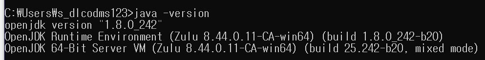
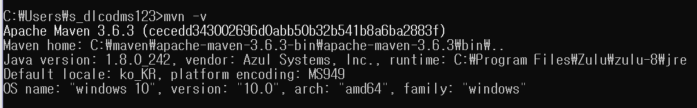

# 편의뽕

## Overview
**편의점에서 뽕을 뽑자. 편의뽕!**
1. 상품정보 및 할인정보
2. 인기 레시피 검색 및 나만의 레시피 공유
3. 위치 기반 편의점 검색 및 재고 확인
4. 할인, 적립, 기프티콘까지 바코드 관리
편의점 이용할 때 필요했던 모든 정보와 바코드를 **편의뽕**에서 관리하세요!


## Before You Begin
프로젝트를 이해하고 사용하기 위해서 다음과 같은 언어, 프레임워크, 환경에 대한 이해가 필요합ㄴ디ㅏ.
- Spring Boot
- MariaDB
- Vue.js
- Redis-server
- Android
- Git

## Language
- JavaScript
- Java
- HTML
- CSS
- Python

## Setup
### Frontend Setting

Node.js 설치

- [https://nodejs.org/ko/download/](https://nodejs.org/ko/download/) - LTS 설치

yarn 설치

- [https://legacy.yarnpkg.com/en/docs/install/#windows-stable](https://legacy.yarnpkg.com/en/docs/install/#windows-stable) - window installer(.msi) 로 설치하였음

@Vue/cli 설치

- yarn global add @vue/cli

Sass 설정

- yarn add node-sass sass-loader

vue-router 설치

- yarn add vue-router

### Vue project Requirments

- ESlint v6.8.0
- Prettier v1.19.1
- babel-eslint​ v10.0.3
- bootstrap-vue ^2.15.0
- jquery ^3.5.1
- tiptap ^1.27.1
- vue-barcode ^1.2.0
- vuetify ^2.2.11
- eslint-plugin-vue
- vue-infinite-loading ^2.4.5
- axios ^0.19.2

### Backend Setting

Spring Boot 설치

- spring 을 사용하기위한 JDK 설치 (OpenJDK - Zulu 사용하였음)

    [https://kr.azul.com/downloads/zulu-community/?&architecture=x86-64-bit&package=jdk](https://kr.azul.com/downloads/zulu-community/?&architecture=x86-64-bit&package=jdk) 

    Zulu 8 LTS for window (.msi) 파일 다운로드

- 설치경로 시스템 환경 변수 path 추가 (C:\Program Files\Zulu\zulu-8\bin\
    JAVA_HOME = C:\Program Files\Zulu\zulu-8
    path 추가 : %JAVA_HOME%\bin\


- Maven 다운로드

    [https://maven.apache.org/download.cgi](https://maven.apache.org/download.cgi) - [apache-maven-3.6.3-bin.zip](http://apache-maven-3.6.3-bin.zip) 다운로드

- 설치경로 시스템 환경 변수 path 추가 (C:\maven\apache-maven-3.6.3-bin\apache-maven-3.6.3\bin)

    MAVEN_HOME = C:\maven\apache-maven-3.6.3-bin\apache-maven-3.6.3

    path 추가 : %MAVEN_HOME %\bin\



Redis-server 설치

```bash
sudo apt-get update
sudo apt-get upgrade
sudo apt-get install redis-server
```

## Build and Run

### Local

```bash
cd frontend
yarn install
yarn serve
```

```bash
cd backend
.\mvnw spring-boot:run
```

### Build

```bash
cd frontend
yarn build
```

백엔드는 .jar파일로 빌드

## Deploy

### AWS EC2 Ubuntu

frontend : nginx
backend : nohup
```bash
nohup java -jar filename.jar&
```
android : playstore 배포
또는 아래의 apk파일을 통해 설치할 수 있습니다.
[apk](app-release.apk)

## Test
테스트 계정
    email : tt@tt.com
    password : 1234